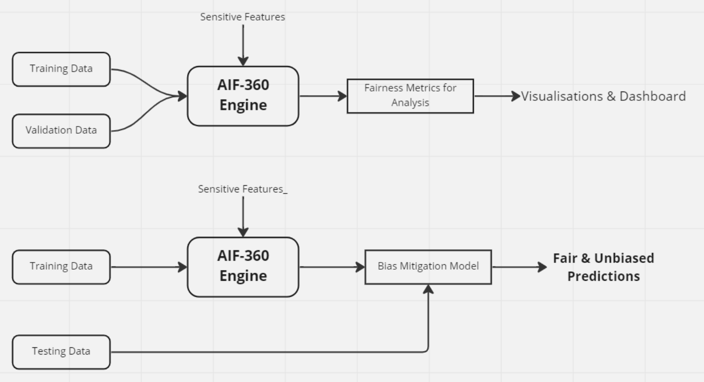

# FairAI: Ethical Bias Mitigation

A Python toolkit for detecting and mitigating ethical bias in machine learning models. FairAI provides wrapper classes around IBM's AI Fairness 360 (AIF360) library to make bias detection and mitigation more accessible and easier to implement in machine learning pipelines.

## About

FairAI is designed to help data scientists identify and mitigate ethical bias in machine learning models. Machine learning systems can inadvertently perpetuate or amplify societal biases present in training data, leading to unfair outcomes for certain demographic groups.

FairAI makes it easier to implement detection and mitigation of bias in ML models throughout the lifecycle of a project in both development and production settings by:

1. Checking for bias in input data and predictions of ML models
2. Mitigating the bias in ML model's predictions

## Key Features

* Detect bias against unprivileged groups in structured datasets
* Support for preprocessing and postprocessing bias mitigation strategies
* Visualization tools to compare bias metrics before and after mitigation
* Implementation of techniques like Reweighing, Reject Option Classification, and more
* Example notebooks demonstrating bias detection and mitigation on real-world datasets
* Simple, intuitive interface that abstracts away the complexity of the AIF360 library

## Installation

### Installing FairAI from Git

```bash
pip install git+https://gitlab.innovaccer.com/aseem.raghav/bias-fairness-framework.git
```

### Installing FairAI manually

Clone the latest version of this repository:

```bash
git clone https://gitlab.innovaccer.com/aseem.raghav/bias-fairness-framework.git
```

Navigate to the root directory of the project and run:

```bash
pip install .
```

## Getting Started

The tutorial notebooks in [fairai.notebooks.examples](https://github.com/A-Raghav/Ethical-Bias-Mitigation/tree/main/notebooks/examples) provide a demonstration on how you can easily integrate a bias mitigation mechanism in your ML project.

To utilize the full power and customizability of the bias-fairness framework, users are advised to also refer to the [AIF-360 library by IBM](https://github.com/Trusted-AI/AIF360).

## Supported Bias Mitigation Algorithms

* **Reweighing** ([Kamiran and Calders, 2012](http://doi.org/10.1007/s10115-011-0463-8))
* **Reject Option Classification** ([Kamiran et al., 2012](https://doi.org/10.1109/ICDM.2012.45))
* **Equalized Odds Postprocessing** ([Hardt et al., 2016](https://papers.nips.cc/paper/6374-equality-of-opportunity-in-supervised-learning))
* **Calibrated Equalized Odds Postprocessing** ([Pleiss et al., 2017](https://papers.nips.cc/paper/7151-on-fairness-and-calibration))

## Why Ethical Bias Mitigation is Important

Discrimination and bias in machine learning models is an area of critical concern:

* The famous `Boston House Prices` dataset (available on [Kaggle](https://www.kaggle.com/datasets/vikrishnan/boston-house-prices)) has an ethical problem - the authors of this dataset engineered a non-invertible variable "B" assuming that racial self-segregation had a positive impact on house prices (Read [this](https://medium.com/@docintangible/racist-data-destruction-113e3eff54a8) article). The purpose of the dataset has since changed from "predicting house prices" to "studying and educating about ethical issues in data science and machine learning".
* "There's software used across the country to predict future criminals. And it's biased against blacks." Read this thought-provoking [article](https://www.propublica.org/article/machine-bias-risk-assessments-in-criminal-sentencing).

## Ethical Bias Mitigation Strategies

Algorithms to detect & mitigate bias and yield fair outcomes fall under 3 categories:

1. **Preprocessing**: Modifying the training data to remove discrimination before model training
2. **Optimizing at training time**: Incorporating fairness constraints during model training
3. **Postprocessing**: Adjusting the predictions of a trained model to achieve fairness

## Architecture Overview

FairAI is designed as a wrapper around AIF360 to simplify implementation:



## Comparison with Other Fairness Libraries

### AI Fairness 360 (IBM)

**Pros:**
* Contains bias mitigation algorithms for: ([link](https://github.com/Trusted-AI/AIF360))  
  * Preprocessing (E.g., Reweighing)  
  * In-Processing (E.g., Adversarial Debiasing)  
  * Postprocessing (E.g., Thresholding)

**Cons:**
* Multiple privileged groups (sensitive features) are not supported (able to include only a single bias privilege group)
* Complex API requiring deep understanding of bias metrics

### Fairlearn (Microsoft)

**Pros:**
* Can include multiple sensitive features at a time

**Cons:**
* Widget features deprecated in the latest release  
* Processing time for `mitigating disparity` is very high  
* CorrelationRemover - manual process, cannot be automated

### Other Libraries
* FairLens ([Github](https://github.com/synthesized-io/fairlens))
* [What-If-Tool](https://pair-code.github.io/what-if-tool/) by Google

Many other libraries are largely in an inactive state or have very few stars on their GitHub pages.

## References

### Basics
* [Types of Bias (Google)](https://developers.google.com/machine-learning/crash-course/fairness/types-of-bias)
* [Python Fairness Libraries](https://techairesearch.com/most-essential-python-fairness-libraries-every-data-scientist-should-know/)
* [AIF360 Overview](https://aif360.mybluemix.net/)
* [AIF360 Tutorials](https://aif360.mybluemix.net/resources#tutorials)
* [Fairlearn FAQ](https://fairlearn.org/v0.6.2/faq.html)
* [The 80% Rule to Measure Disparity](https://www.giskard.ai/knowledge/how-to-test-ml-models-5-the-80-rule-to-measure-disparity)
* [Breaking Myths About AI Fairness](https://towardsdatascience.com/tutorial-breaking-myths-about-ai-fairness-the-case-of-biased-automated-recruitment-9ee9b2ecc3a)
* [Machine Bias in Criminal Sentencing](https://www.propublica.org/article/machine-bias-risk-assessments-in-criminal-sentencing)

### Research Papers
* [Overview of Algorithmic Fairness](https://www.mdpi.com/2078-2489/13/5/237?type=check_update&version=1)